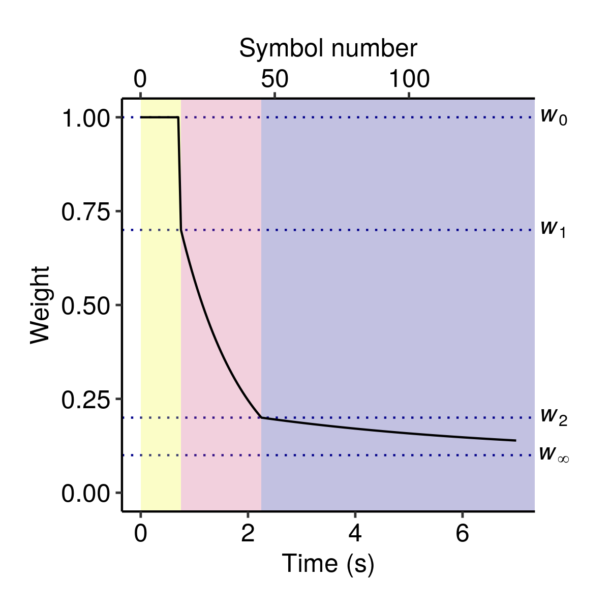

<!-- README.md is generated from README.Rmd. Please edit that file -->

```{r setup, include = FALSE}
knitr::opts_chunk$set(
  collapse = TRUE,
  comment = "#>",
  fig.path = "man/figures/README-",
  out.width = "100%"
)
```
# ppm

<!-- [](https://www.tidyverse.org/lifecycle/#experimental) -->
<!-- [](https://travis-ci.org/pmcharrison/ppm) -->
<!-- [](https://ci.appveyor.com/project/pmcharrison/ppm) -->
<!-- [](https://coveralls.io/r/pmcharrison/ppm?branch=master) -->
<!-- [](https://doi.org/10.5281/zenodo.2620414) -->

The `ppm` package implements variants of the Prediction by Partial Matching (PPM)
algorithm as originally introduced by @Cleary1984,
subsequently developed by @Bunton1996,
and reviewed by @Pearce2005.

## Installation

To install from GitHub:

``` r
if (!require("devtools")) install.packages("devtools")
devtools::install_github("pmcharrison/ppm")
```

## PPM

The standard PPM model is a variable-order Markov order model that 
blends together the predictions of multiple *n*-gram models.
An *n*-gram model generates predictions by tabulating the 
occurrences of subsequences of *n* tokens -- *n*-grams -- in the training dataset.
These *n*-gram models are combined using a technique called *smoothing*.

Many versions of PPM exist corresponding to different smoothing and order selection
techniques. The implementation in this package uses *interpolated smoothing*
as introduced by Bunton (1996), along with a selection of different *escape methods*
which determine the weighting parameters for the *n*-gram models.
*Update exclusion* is also supported.
The implementation also supports the order selection technique from PPM*,
which was designed to help PPM extend to arbitrarily long *n*-gram orders.
Note however that the present implementation is not optimized for large order bounds;
with an infinite order bound, model training has computational complexity quadratic 
in the length of the input, whereas alternative implementations can achieve
linear complexity in the length of the input.

You can create a PPM model object using the `new_ppm_simple` function:

```{r}
library(ppm)
mod <- new_ppm_simple(alphabet_size = 5)
```

See `?new_ppm_simple` for information on configuring the model.

Note how we provided an `alphabet_size` parameter to the model.
This compulsory parameter refers to the size of the alphabet over which
the model will be trained and will generate predictions.
For example, if we were modelling the letters A-Z, we might set 
this parameter to 26, corresponding to the 26 letters in the English alphabet.

Input sequences are coded as integers within this alphabet.
For example, we might define a sequence as follows:

```{r}
seq_1 <- c(1, 3, 3, 1, 2, 1, 3)
```

The `factor` function from base R can be useful for making this encoding
from a series of textual tokens.
Factor objects are represented as integer vectors under the hood,
but they come with an associated mapping between the integers and 
their labels, which makes them easier to manipulate within R.
For example:

```{r}
print(letters)
seq_2 <- factor(c("a", "b", "r", "a", "c", "a", "d", "a", "b", "r", "a"),
                levels = c("a", "b", "c", "d", "r"))
print(seq_2)
print(as.integer(seq_2))
```

The *ppm* package treats factor objects like their underlying integer representations.

You feed sequences to the PPM model using the `model_seq` function.
By default, the model processes these sequences incrementally,
one symbol at a time.
It simultaneously learns from these incoming symbols,
and generates predictions for future symbols based
on what came before.
For example:

```{r}
res <- model_seq(mod, seq_2)
print(res)
```

The output of `model_seq` is a tibble with several columns.
Each row corresponds to a different element of the input sequence,
organised in order of presentation.
The row describes what happened when the model tried to predict
this element, conditioned on the preceding elements in the sequence.
Each row has the following fields:

- `symbol` - The integer encoding of the corresponding symbol in the sequence.
- `model_order` - The highest-order *n*-gram model used for generating predictions.
- `information_content` - The negative log probability, or *information content*,
of the observed symbol according to the model.
- `entropy` - The entropy of the model's predictive distribution when predicting
that element of the sequence.
- `distribution`- The predictive probability distribution when predicting
that element of the sequence.

Often we are particularly interested in the `information_content` field,
which gives us an index of the model's surprisal at different 
parts of the input sequence.

```{r, dpi = 300, out.width = "50%", fig.align = 'center', fig.width = 4, fig.height = 4}
plot(res$information_content,
     xlab = "Position",
     ylab = "Information content (bits)",
     type = "l", 
     ylim = c(0, 5))
```

The `model_seq` function changes the input PPM model object,
even the absence of the assignment operator `<-`.
Typically, the PPM model will have been updated with the contents of 
the training sequence. 
If we present the same sequence again, it should prove to be much more predictable (red line):

```{r, dpi = 300, out.width = "50%", fig.align = 'center', fig.width = 4, fig.height = 4}
res_2 <- model_seq(mod, seq_2)
plot(res$information_content,
     xlab = "Position",
     ylab = "Information content (bits)",
     type = "l", 
     ylim = c(0, 5))
points(res_2$information_content,
       type = "l", col = "red")
```

## PPM-Decay

The original PPM algorithm has a perfect memory,
and weights all historic observations equally when generating predictions.
The PPM-Decay modifies this behaviour,
introducing a customisable memory decay kernel that determines the 
weight of historic observations as a function of the 
time and number of events observed since the original event.
For example, a decay kernel for modelling auditory prediction might 
resemble the following:

```{r, out.width = "50%", fig.align = 'center', echo = FALSE}

```

In its most general form (illustrated above), 
the decay kernel comprises three phases:

- A buffer phase (yellow);
- A short-term memory phase (red);
- A long-term memory phase (blue).

The parameters for these different phases, in particular durations
and relative weights, are customisable.
Each phase can be disabled separately to produce
simpler families of decay kernels.
For example, the default parameters define a one-stage exponential decay kernel;
adding a buffer phase and retrieval noise produces the two-stage decay kernel
in @Harrison2019.

The `new_ppm_decay` function is used to create a new PPM-Decay model.
It works in a similar way to `new_ppm_simple`, described above for PPM models.
The function has many customisable parameters (see `?new_ppm_decay`)
that support the specification of various kinds of decay kernels,
including single-stage exponential decays,
two-stage exponential decays,
exponential decays with non-zero asymptotes,
and kernels combining a flat buffer period with subsequent exponential decays.

```{r}
mod_decay <- new_ppm_decay(alphabet_size = 5, ltm_half_life = 2)
```

When modelling a sequence with a PPM-Decay model,
you need to specify both the sequence itself and 
a numeric vector corresponding to the timepoints of the 
symbol observations.

```{r, dpi = 300, out.width = "50%", fig.align = 'center', fig.width = 4, fig.height = 4}
seq_2_time <- seq_along(seq_2)
print(seq_2_time)

res_3 <- model_seq(mod_decay, 
                   seq_2,
                   time = seq_2_time)

plot(res$information_content,
     xlab = "Position",
     ylab = "Information content (bits)",
     type = "l", 
     ylim = c(0, 5))
points(res_3$information_content,
       type = "l", col = "blue")
```

Here the original PPM output is plotted in black,
the PPM-Decay model in blue.

## References
