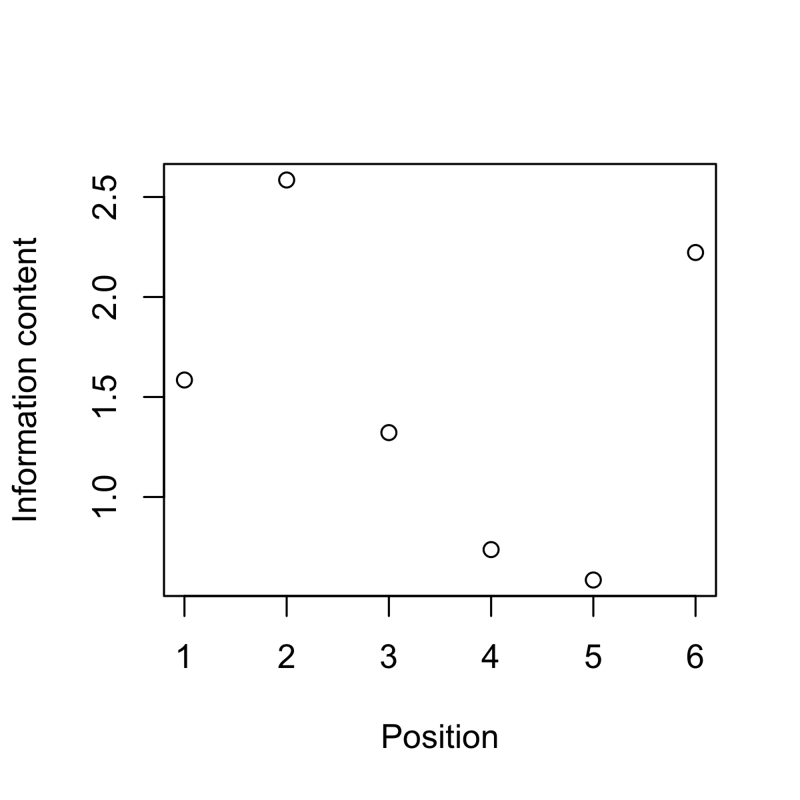
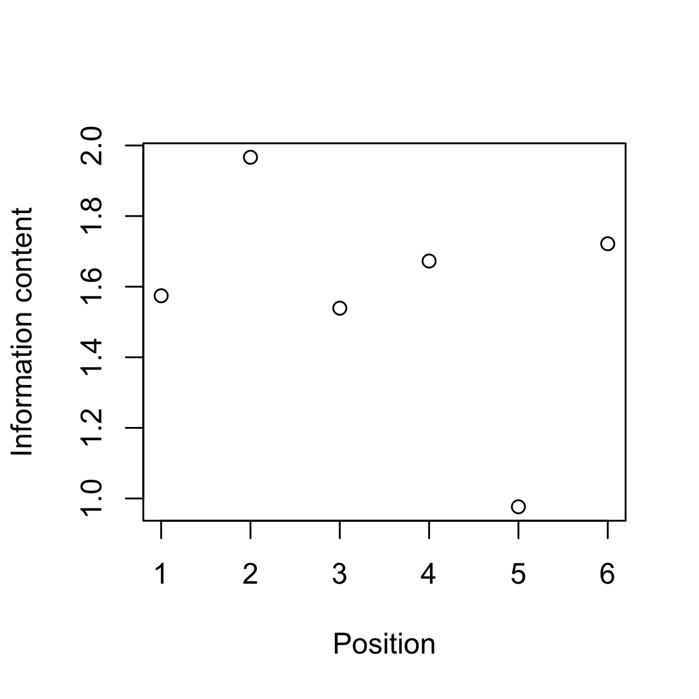

<!-- README.md is generated from README.Rmd. Please edit that file -->

# ppm

The `ppm` package implements variants of the Prediction by Partial
Matching (PPM) algorithm as originally introduced by Cleary and Witten
(1984), subsequently developed by Bunton (1996), and reviewed by Pearce
(2005).

## Installation

To install from GitHub:

``` r
if (!require("devtools")) install.packages("devtools")
devtools::install_github("pmcharrison/ppm")
```

## Example usage

### Original PPM

``` r
library(ppm)
seq <- data.frame(
  pos = 1:6,
  time = 1:6,
  val = c(1, 2, 1, 2, 1, 1)
)
mod <- new_ppm_simple(alphabet_size = 3)
res <- model_seq(mod, seq$val, return_distribution = FALSE)

plot(seq$pos, res$information_content,
     xlab = "Position",
     ylab = "Information content")
```



### PPM-Decay

``` r
mod_2 <- new_ppm_decay(alphabet_size = 3)
res_2 <- model_seq(mod_2, seq$val, time = seq$time,
                   return_distribution = FALSE)

plot(seq$pos, res_2$information_content,
     xlab = "Position",
     ylab = "Information content")
```



## References

<div id="refs" class="references">

<div id="ref-Bunton1996">

Bunton, Suzanne. 1996. “On-line stochastic processes in data
compression.” PhD dissertation, Seattle, WA: University of Washington.

</div>

<div id="ref-Cleary1984">

Cleary, John G., and Ian H. Witten. 1984. “Data compression using
adaptive coding and partial string matching.” *IEEE Transactions on
Communications* 32 (4): 396–402.
<https://doi.org/10.1109/TCOM.1984.1096090>.

</div>

<div id="ref-Pearce2005">

Pearce, Marcus T. 2005. “The construction and evaluation of statistical
models of melodic structure in music perception and composition.” PhD
thesis, London, UK: City University.

</div>

</div>
